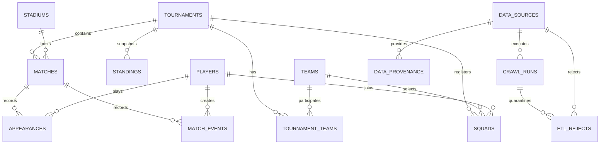

# Thiết kế MySQL cho World Cup Atlas

MySQL 8.4, charset `utf8mb4`, collation `utf8mb4_unicode_ci`. Schema được quản lý bởi Alembic; API worker không tự tạo hoặc sửa bảng.

Dữ liệu seed gồm 23 kỳ đã hoàn thành từ 1930 đến 2026; các giải 1942 và 1946 không tổ chức.

## Phân vùng trách nhiệm

- Nghiệp vụ ổn định: `tournaments`, `teams`, `players`, `tournament_teams`, `squads`, `matches`, `appearances`, `match_events`, `standings`, `stadiums`, `news_articles`.
- Thu thập và kiểm toán: `data_sources`, `crawl_runs`, `data_provenance`, `etl_rejects`.
- `data_provenance.raw_payload` giữ bản chuẩn hóa gần nguồn để có thể materialize lại khi mapping thay đổi.
- `etl_rejects` cách ly payload không hợp lệ cùng thông báo lỗi và lần chạy nguồn; một bản ghi xấu không rollback toàn bộ job.
- `news_articles.url_hash` là SHA-256 vì MySQL không nên tạo unique index trực tiếp trên URL UTF-8 dài.
- `news_articles.is_world_cup` là nhãn kiểm duyệt chủ đề có index. API chỉ đọc các dòng mang giá trị `true`; dòng bị loại vẫn được giữ để truy vết và có thể phân loại lại.
- Tỷ số luân lưu tách khỏi tỷ số trận; bàn thắng và thẻ nằm trong `match_events` để thống kê không phải đọc JSON.

## Index quan trọng

- Năm giải, mã đội, tên cầu thủ, thời gian trận và bài báo.
- Khóa ghép `(tournament_id, external_id)` cho trận.
- Khóa ghép `(match_id, event_type)` cho thống kê bàn/thẻ.
- Khóa ghép unique `(match_id, external_id)` chống trùng sự kiện khi chạy lại crawler.
- Khóa ghép nguồn `(source_id, entity_type, external_key)` đảm bảo crawler idempotent.
- Các foreign key thường dùng để lọc đều có index.
- Migration `003_statistics_indexes` bổ sung composite index theo access pattern: giải–vòng–thời gian trận, đội nhà/khách–giải, cầu thủ–trận, cầu thủ–giải và đội/cầu thủ–loại sự kiện–trận.
- Migration `004_world_cup_news_relevance` thêm nhãn/index lọc tin; migration `005_cleanup_demo_duplicates` hợp nhất identifier demo cũ vào identifier chuẩn của dataset.
- Các query xếp hạng thực hiện `GROUP BY` và `COUNT(DISTINCT ...)` trực tiếp trong MySQL, chỉ trả tối đa `limit`; API không tải toàn bộ bản ghi về Python để cộng thủ công.

## Chiến lược crawl

1. Adapter tải và chuẩn hóa bản ghi, không truy cập ORM.
2. Transformer chuẩn hóa Unicode NFKC, khoảng trắng, tên người, số, boolean, ngày ISO và URL canonical.
3. Validator kiểm tra năm World Cup, trường bắt buộc, tỷ số/phút hợp lệ và tính nhất quán của hai đội.
4. Pipeline ghi `crawl_runs` và upsert `data_provenance` theo checksum; mỗi payload nằm trong một savepoint.
5. Materializer chuyển bản ghi hợp lệ sang bảng nghiệp vụ; payload lỗi được ghi vào `etl_rejects`.
6. Chạy lại nguồn không tạo trùng; bản ghi đổi nội dung được cập nhật và vẫn truy vết được nguồn.
7. Scheduler nên chia job theo `source + year`, giới hạn tốc độ, retry exponential backoff và tuân thủ robots/điều khoản nguồn.

Thứ tự tải dữ liệu cấu trúc được cố định theo quan hệ khóa ngoại: `matches` → `group_standings` → `tournament_standings` → `squads` → `player_appearances` → `goals` → `bookings` → `penalty_kicks` → `substitutions`. Nhờ vậy bảng xếp hạng, sự kiện và lượt ra sân luôn tham chiếu được giải, trận, đội và cầu thủ đã materialize.

RSS trực tiếp phục vụ tin mới; chế độ `crawl-news --year` tìm metadata kho bài cũ theo từng kỳ và giới hạn vào sáu tên miền báo Việt Nam. Cả hai luồng dùng chung bộ phân loại: bắt buộc có ngữ cảnh World Cup và loại Club World Cup, giải nữ, futsal, giải trẻ cùng các môn thể thao khác. Kết quả vẫn phải được kiểm tra điều khoản nguồn trước khi vận hành ở quy mô lớn.
